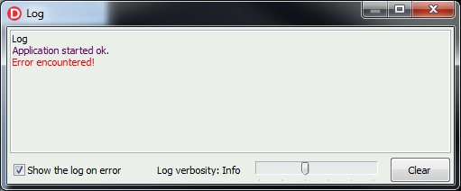

# Delphi-LightSaber - LogLib

A simple but effective visual log control/library. The programmer can send messages to a log window from anywhere in his code.  The Log window can be set to automatically pop up when an error message is sent to it. Depending on the chosen verbosity level of the log (see the Verbosity property) low-level messages (like verbose/debug messages) are shown or not.

**Non-visual log (TRamLog)** 
This class is for batch jobs or for CLI (command line interface) programs.  
The idea is that your Delphi objects can send data to the non-viusal log, during a batch job. At the end of the batch, all collected messages can be shown in the visual log.  

**Visual log (TRichLog)** 
If you connect the TRamLog to the visual log (TRichLog), the messages are shown in real time, as the batch job progresses. There is a pre-defined form that holds the log. You need to call CreateLogForm function located in FormLog.pas at your application startup.  
TRichLog allows you to have one single log window per application that will receive messages from the entire application.  

**Verbosity**

Both logs support several verbosity levels (verbose, info, warnings, errors, etc).  
The log receives only messages that are above the specified verbosity threshold.  
For example, if the log is set to show only warnings and errors and you send a message marked as "verbose", then the messages will not be shown.
Each verbosity level is shown in a predefined color.  

**I/O**  
The log can be saved to disk to a binary file so it can be restored on the next app startup.  

**Demo**  
See https://github.com/GodModeUser/GUI-AutoSave for a compilable demo.  

